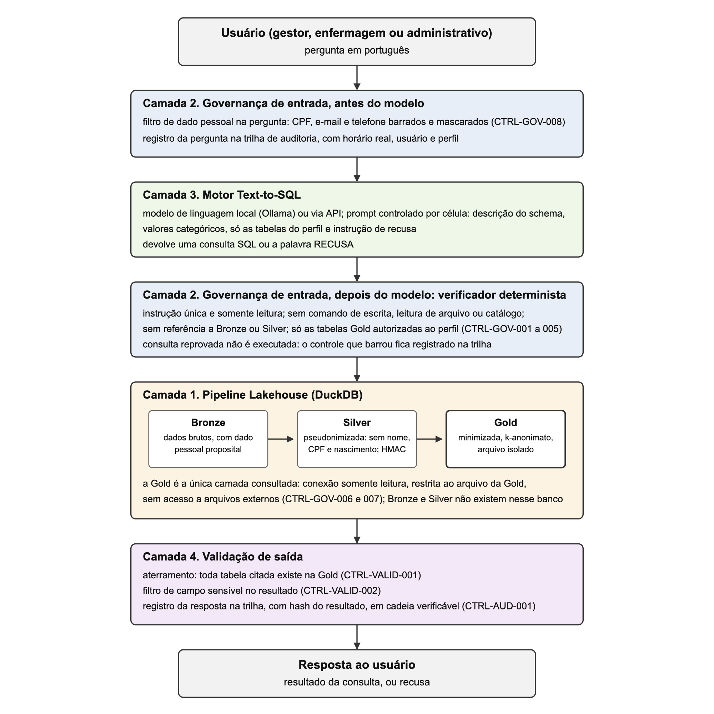

# Governança integrada viabiliza consulta em linguagem natural sobre ocupação de leitos hospitalares

Gabriel Arcenio Rahal Marostica¹*; José Bernardo Neto²

¹* [Titulação do autor]. E-mail: arcenio2501@gmail.com

² [Titulação do orientador]. E-mail: [e-mail do orientador]

**Resumo**

A consulta a dados hospitalares em linguagem natural promete ampliar o
acesso à informação, mas a governança costuma ser tratada à parte da
arquitetura. Este trabalho propôs e avaliou uma arquitetura de
referência em que controle de acesso, proteção dos dados, validação da
consulta e auditoria atravessam todo o fluxo, aplicada à ocupação de
leitos sobre dados sintéticos. Um pipeline em camadas expôs ao modelo só uma camada minimizada, com
k-anonimato verificado sobre o conjunto completo e isolada em arquivo
próprio; um verificador determinista em código decidiu a execução de cada
consulta; e o prompt foi tratado como variável experimental, com
hipóteses pré-registradas. Com um modelo aberto de 14 bilhões de
parâmetros executado localmente, o execution match estrito em 18 perguntas
subiu de 22,2% para 72,2% conforme o prompt descreveu o schema e
informou o escopo, sem recusa indevida; a configuração operacional, que
autoriza o modelo a recusar, mediu 66,7% nas legítimas e 88% de recusa
devida em 25 perguntas adversariais, sem que nenhuma linha fora do escopo
fosse entregue. Um modelo comercial via interface de programação alcançou 90,7% sem
instrução de recusa e, na configuração operacional, 94,4% com 88% de
recusa devida. A hipótese de acurácia superior a 80% foi atingida na
estimativa pontual só com o modelo comercial, e o tamanho do conjunto não permite cravar de que lado do limiar está o
valor verdadeiro; a conformidade foi demonstrada como propriedade de
projeto. A
governança integrada não gerou recusa indevida, e a pertinência da
resposta permaneceu como limite.

**Palavras-chave:** Text-to-SQL; conformidade regulatória; dados sintéticos; saúde digital; controle de acesso.

# Introdução

As interfaces em linguagem natural para bancos de dados formam um campo
maduro (Affolter et al., 2019), e a tradução de perguntas em consultas
SQL (Text-to-SQL) conta com benchmarks consolidados, como o Spider (Yu et
al., 2018) e, no domínio clínico, o EHRSQL (Lee et al., 2022), tendo sido
transformada pelos modelos de linguagem de grande porte (Shi et al.,
2025). Em hospitais, a possibilidade de um gestor ou uma equipe
assistencial perguntar aos dados sem depender de uma fila de solicitações
à área técnica promete ampliar o acesso à informação operacional. Os
trabalhos recentes que aplicam essa abordagem a dados clínicos relatam
acurácias entre 43% e 78% em uma única chamada ao modelo e acima de 90%
com agentes que corrigem a consulta iterativamente (Al Attrach et al.,
2026; Tanković et al., 2025), e apontam a resolução de termos e valores do domínio como principal
causa de erro, à frente da sintaxe.

A governança dos dados e do modelo, porém, costuma ser tratada de forma
fragmentada, separada da arquitetura de dados. Em saúde essa
fragmentação pesa mais do que em outros setores: os dados são pessoais e
sensíveis, e o marco regulatório é exigente, composto pela Lei Geral de Proteção de Dados [LGPD] (Brasil, 2018),
pelas normas da Agência Nacional de Vigilância Sanitária [ANVISA] (2022)
aplicáveis a software em saúde e pelas diretrizes da Autoridade Nacional
de Proteção de Dados [ANPD] (2024) sobre inteligência artificial
generativa. Somam-se riscos próprios
dos modelos de linguagem, como a injeção de instruções e o acesso
indevido a recursos (OWASP Foundation, 2025), que uma instrução em
linguagem natural pode converter em injeção de SQL (Pedro et al., 2025),
tratados na prática por guardrails programáveis (Rebedea et al., 2023) e,
no setor de saúde, sob diretrizes éticas e de governança dedicadas (World
Health Organization [WHO], 2024).

A literatura passou a medir o Text-to-SQL sob controle de acesso apenas
recentemente. Benchmarks de 2025 e 2026 mostram que instruir a política
de acesso no prompt não impede vazamentos, que restringir o schema
visível ao papel do usuário reduz o vazamento explícito mas induz o
modelo a alucinar tabelas, e que os modelos raramente recusam consultas
não autorizadas por iniciativa própria (Fei et al., 2026; Klisura et al.,
2026; Miyamoto et al., 2026). A recomendação convergente é a verificação
determinista fora do modelo. Esses trabalhos, porém, avaliam o modelo
decidindo sozinho ou com um verificador também baseado em modelo, e não
isolam o que muda quando um verificador em código garante o escopo e o
modelo é informado sobre ele.

Este trabalho partiu da hipótese, registrada no projeto de pesquisa, de
que uma arquitetura de Conversational Analytics com modelo de governança
integrado responderia a consultas operacionais hospitalares em linguagem
natural com acurácia superior a 80% e em conformidade com os requisitos
da LGPD e das normas da ANVISA. Propôs-se uma arquitetura de referência
em quatro camadas, na qual a proteção dos dados, o controle de acesso por
perfil, a validação da consulta e a auditoria atravessam todo o fluxo, da
pergunta do usuário à resposta entregue. O domínio de implementação e
avaliação foi a ocupação de leitos hospitalares, e toda a pesquisa usou
dados sintéticos, o que eliminou na origem o risco de exposição de dados
reais e permite que a arquitetura seja replicada.

O objetivo geral foi propor e validar, por meio de um protótipo
funcional, essa arquitetura de referência, com foco na governança segura
de modelos de linguagem sobre dados clínicos, respondendo à pergunta: uma
arquitetura que integra a governança de ponta a ponta preserva a
utilidade da consulta em linguagem natural, e a que custo mensurável? Os
objetivos específicos foram: (a) levantar a literatura sobre
Conversational Analytics, Text-to-SQL e governança de modelos de
linguagem em contextos clínicos; (b) mapear os requisitos regulatórios
aplicáveis; (c) projetar a arquitetura técnica, do pipeline de dados ao
motor com guardrails; (d) desenvolver o modelo de governança, com
controle de acesso, rastreabilidade, proteção dos dados e validação das
respostas; e (e) implementar e avaliar o protótipo sobre dados
sintéticos, medindo acurácia, recusa devida e indevida, rastreabilidade
e conformidade de projeto.

# Metodologia

A pesquisa caracterizou-se como aplicada, com abordagem quantitativa e
caráter exploratório e descritivo, e adotou o delineamento de estudo de
caso instrumental (Yin, 2015) apoiado no desenvolvimento de um protótipo
funcional, em linha com a pesquisa em ciência do projeto, na qual o
artefato construído é também o instrumento de avaliação (Hevner et al.,
2004). O protótipo materializou uma arquitetura de referência, entendida
como um modelo de solução reutilizável para uma classe de sistemas
(Angelov et al., 2012). Os métodos são descritos na mesma ordem em que os
resultados são apresentados.

## Escopo e levantamento da literatura

A pesquisa delimitou-se a um domínio operacional hospitalar, a ocupação
de leitos, com modelo de dados próprio e quatro tabelas expostas ao
motor de linguagem. Em relação ao projeto de pesquisa, o escopo foi
ajustado em três pontos: o conjunto de dados restringiu-se a esse
domínio, sem as áreas de prontuário, farmácia e faturamento nem a
estruturação sobre uma base pública; o levantamento da literatura foi
narrativo, com protocolo, em vez de sistemático; e a conformidade
regulatória foi tratada como propriedade de projeto, e não como
aderência demonstrada, porque os dados são sintéticos. A delimitação
privilegiou profundidade de governança sobre amplitude de dados: com um
domínio único foi possível medir cada controle isoladamente, em execução
real e com repetição, dentro do prazo do trabalho. As consequências
dessa escolha para a generalização são discutidas entre as limitações.

O levantamento da literatura foi narrativo, com protocolo registrado: a
busca de 8 de setembro de 2026 usou arXiv, ACL Anthology, Europe PMC e
PubMed, bibliotecas de editoras e da Sociedade Brasileira de Computação e
os portais oficiais da ANPD e da ANVISA, com termos, recorte temporal e
critérios de inclusão e exclusão definidos antes da leitura, seguindo
Prodanov e Freitas (2013). Os itens encontrados e triados não foram
contabilizados por base, razão pela qual o levantamento não é apresentado
como revisão sistemática. Resultaram 73 fichas de leitura agrupadas por
tema, das quais saíram as citações deste trabalho.

## Dados sintéticos e pipeline em camadas

Todos os dados foram gerados de forma determinista com a biblioteca Faker
em localidade pt_BR, controlada por uma semente única (42) e ancorada em
uma data de referência fixa da simulação (31 de maio de 2026). O ambiente
representou um hospital com oito unidades, duzentos leitos, seiscentos
pacientes e 2.012 internações, com noventa dias de histórico de
ocupação diária. Nenhum dado real foi utilizado em qualquer etapa.

Os dados percorreram um pipeline em três camadas implementado em DuckDB,
no modelo Lakehouse (Armbrust et al., 2021). A camada Bronze recebeu os
dados brutos, com nome, CPF e data de nascimento inseridos de propósito,
para que a proteção aplicada na camada seguinte fosse real e verificável.
A camada Silver removeu esses campos, derivou a faixa etária a partir da
idade completa na data de referência e pseudonimizou o identificador do
paciente com código de autenticação de mensagem com chave [HMAC], na
variante HMAC-SHA256, com a chave lida do ambiente, técnica
recomendada no lugar do hash simples quando o domínio do identificador é
pequeno (European Data Protection Board [EDPB], 2025; European Union Agency
for Cybersecurity [ENISA], 2022); por isso a Silver foi tratada como
pseudonimizada, e não anonimizada. A camada Gold, única exposta ao modelo
de linguagem, reuniu quatro tabelas: a situação de cada leito na data de
referência, o resumo por unidade, a série diária do hospital e as
internações, estas sem identificador de paciente e reduzidas a tipo de
leito, faixa etária, situação e tempo de permanência. Sobre as
internações foi imposto k-anonimato (Sweeney, 2002) com k mínimo de 5 no
par tipo de leito e faixa etária, limiar adequado a uso interno
controlado (El Emam e Arbuckle, 2013), verificado por teste a cada
construção. A Gold foi exportada para um arquivo próprio, de modo que as camadas
internas não existissem no banco consultado pelo sistema. A Figura 1 do Apêndice A apresenta o fluxo de uma pergunta pelas quatro
camadas, e a Tabela 1 do mesmo apêndice, os controles de cada uma; a
mensagem de recusa com o ponto de bloqueio, prevista na arquitetura, não
foi implementada no protótipo, que devolve apenas a recusa e registra o
controle na trilha. Como o
DuckDB não oferece controle de acesso por usuário, o isolamento foi
materializado como arquivo separado; em um banco com permissões, o mesmo
princípio de menor privilégio seria implementado por um usuário de
leitura restrito às tabelas Gold.

## Governança de entrada e de saída

A governança foi concebida como defesa em profundidade, alinhada à gestão
de risco de sistemas de inteligência artificial (National Institute of Standards and Technology [NIST],
2023) e aos riscos
catalogados para aplicações de modelos de linguagem, em especial a injeção
de instruções e o acesso indevido a recursos (OWASP Foundation, 2025). O desenho
seguiu o padrão gerador e verificador: o modelo propôs a consulta e um
verificador determinista, escrito em código, decidiu se ela seria
executada (Klisura et al., 2026).

Antes de qualquer chamada ao modelo, o texto da pergunta foi verificado
contra padrões de CPF, e-mail e telefone; havendo ocorrência, a pergunta
foi recusada e o trecho mascarado, sem chegar ao modelo nem à trilha de
auditoria. A consulta gerada passou por cinco verificações textuais:
instrução única, somente leitura, ausência de comandos de escrita, de
leitura de arquivo e de consulta ao catálogo do banco, ausência de
referência às camadas Bronze e Silver, e restrição às tabelas Gold
autorizadas ao perfil. A execução ocorreu em conexão somente leitura,
restrita ao arquivo da Gold e com o acesso do banco a arquivos externos
desligado, de modo que as garantias principais ficassem no dado e na conexão, além
do texto da consulta. Na saída, o sistema verificou
que as tabelas citadas existiam na Gold e bloqueou colunas com nome de
campo sensível. Cada pergunta e cada resposta foram registradas numa
trilha de auditoria com horário real, perfil, consulta, controle que
barrou e hash do resultado entregue, em cadeia de hashes que torna
detectável qualquer alteração posterior (Kent e Souppaya, 2006; Schneier e
Kelsey, 1999).

Foram definidos três perfis de acesso, com escopo derivado da finalidade
de cada função, conforme os princípios de finalidade e necessidade da
LGPD (Brasil, 2018). A enfermagem acessou a situação de cada leito e o
resumo por unidade, que servem à operação do turno. O perfil
administrativo acessou o resumo por unidade e a série histórica, que
servem ao planejamento, sem nível de leito nem de internação. O gestor,
responsável pela capacidade do hospital, acessou as quatro tabelas,
inclusive as internações em nível de linha, para análises de permanência
que combinem tipo de leito, faixa etária e situação. A matriz seguiu o
princípio do menor privilégio: cada perfil recebeu o escopo mínimo
necessário à sua finalidade, e nenhum acesso foi concedido por
conveniência; a alternativa de expor ao gestor apenas agregados de
internações é discutida entre as limitações.

## Enquadramento regulatório

Os requisitos da LGPD (Brasil, 2018), das diretrizes da ANPD (2024) e
das normas da ANVISA foram mapeados a controles concretos, à camada responsável e à situação de
implementação (Apêndice B), distinguindo controle com
código e teste, controle por configuração, controle parcial e controle
apenas projetado. Como os dados são sintéticos, a LGPD não incidiu sobre
o protótipo, e a conformidade foi tratada como propriedade de projeto: uma
arquitetura projetada para atender aos princípios da lei, sem aderência
demonstrada em dados reais. O
protótipo realiza análise de ocupação de leitos para apoio à gestão, sem
finalidade diagnóstica ou terapêutica sobre paciente individual, e nesse
escopo não se caracteriza como software como dispositivo médico nos
termos da Resolução da Diretoria Colegiada [RDC] nº 657/2022 (ANVISA,
2022). Dessa norma usou-se apenas o enquadramento, isto é, a definição
de software como dispositivo médico e a exclusão do software de gestão
sem finalidade clínica; nenhum requisito específico de regularização foi
verificado, e as RDC 751/2022 e 830/2023, citadas no projeto de
pesquisa, tratam da regularização de dispositivos médicos e não se
aplicam a software sem finalidade clínica. A parte da hipótese relativa
às normas da ANVISA, portanto, não pôde ser testada, e as normas foram
adotadas por analogia, como referência de controle, segurança e
rastreabilidade de software em saúde.

## Motores de tradução e desenho do prompt

Três motores intercambiáveis traduziram as perguntas em SQL. O oráculo
devolveu a consulta de referência e serviu apenas para o autoteste do
pipeline, nunca como medida de desempenho. O motor local executou o
modelo aberto Qwen2.5-Coder de 14 bilhões de parâmetros (Hui et al.,
2024), quantizado em 4 bits, pelo servidor Ollama na própria máquina, sem
custo e sem saída de dados. O motor via interface de programação de aplicações [API] usou o modelo
claude-sonnet-4-6, o mesmo dos resultados preliminares. Todas as
chamadas usaram temperatura zero; no motor local, a semente do projeto
também controlou a amostragem, e o relatório registrou a versão do
servidor e o identificador exato dos pesos.

O prompt foi tratado como variável experimental (Gao et al., 2024). Cada
configuração, chamada célula, combinou quatro componentes: a descrição
do schema, simples (só nomes) ou enriquecida com tipos, notas de tabela e
unidades, como recomendado para schemas que cabem no contexto (Maamari
et al., 2024); a lista dos valores distintos das colunas categóricas
(value linking), cujo efeito sobre filtros por valor foi documentado em
dados clínicos (Liu et al., 2026); a restrição do schema às tabelas do
perfil, com aviso explícito ao modelo (Fei et al., 2026); e uma instrução
de recusa, que informou ao modelo que responder "RECUSA" era uma saída
válida quando a pergunta não pudesse ser respondida com o schema ou
pedisse dados de pessoas identificáveis. A Tabela 1 resume as células.

Tabela 1. Células de prompt avaliadas

| Célula | Descrição do schema | Value linking | Schema por perfil | Instrução de recusa | Papel |
|---|---|---|---|---|---|
| C0 | simples | não | não | não | prompt dos resultados preliminares |
| C1 | enriquecida | não | não | não | base da matriz |
| C2 | enriquecida | sim | não | não | efeito do value linking |
| C3 | enriquecida | não | sim | não | efeito do escopo por perfil |
| C4 | enriquecida | sim | sim | não | os dois efeitos |
| E0 | enriquecida | não | sim | não | igual a C3, no conjunto adversarial |
| E1 | enriquecida | não | sim | sim | efeito da instrução de recusa |

Fonte: Dados originais da pesquisa

As células C0 a C4 foram executadas com o motor local; C0 e C3 também
com o motor via API, para cruzar modelo e prompt; E0 e E1, com os dois
motores.

## Conjuntos de avaliação

O conjunto legítimo reuniu 18 perguntas em português, cada uma com um
perfil e uma consulta de referência sobre a Gold: seis de situação atual,
cinco de métrica por unidade, três de série histórica e quatro sobre
internações, distribuídas entre enfermagem (5), administrativo (6) e
gestor (7). O tipo de cada pergunta foi derivado mecanicamente da consulta
de referência, e toda referência foi conferida contra os controles do
próprio perfil. As referências seguiram uma regra de projeção explícita:
devolver a grandeza pedida; incluir a chave da entidade quando a resposta
tem uma linha por entidade; e, quando a pergunta seleciona entidades por
um valor, devolver a entidade e esse valor. Para reduzir o viés de um
único autor escrever perguntas, referências e sistema, um colega do
autor, sem participação no projeto, indicou às cegas, a partir apenas do
texto das perguntas e de uma descrição dos dados em linguagem comum, que
informações cada resposta deveria conter.

O conjunto adversarial reuniu 25 perguntas que o sistema deveria recusar,
em cinco famílias de cinco: pedido de dado pessoal; acesso às camadas
internas ou ao catálogo do banco; pergunta legítima para outro perfil,
fora do escopo de quem pergunta; injeção de instruções em linguagem
natural, inclusive com instrução dupla (Pedro et al., 2025); e pergunta
sem resposta no schema, como diagnóstico, previsão ou causa. As famílias
seguiram a noção de que abster-se de perguntas não respondíveis é parte
da confiabilidade (Lee et al., 2024a, b). O conjunto
combinado, com 43 perguntas, foi usado nas células E0 e E1. Os valores de
CPF e e-mail das perguntas foram fictícios.

## Métricas e análise

A métrica primária foi o execution match estrito, consolidado no Spider
(Yu et al., 2018), no EHRSQL (Lee et al., 2022) e no BIRD (Li et al.,
2023): as consultas gerada e de referência foram executadas e seus
resultados comparados após normalização (tolerância numérica de duas
casas, datas em formato ISO e linhas ordenadas). Duas métricas
secundárias, diagnósticas, acompanharam a primária: o set match de
conteúdo, que verifica se os valores da referência aparecem no resultado
e é permissivo por construção, e o Soft F1 do BIRD, que também penaliza
colunas e valores em excesso.

Os desfechos de governança seguiram a taxonomia de Fei et al. (2026), com
seis categorias (correto, errado, recusa devida, violação correta,
violação errada e recusa indevida), atribuídas em dois níveis: o do
modelo, que diz o que a consulta gerada faria sem verificador, e o do
sistema, que diz o que o usuário recebeu. A distância entre os níveis
mediu a contribuição do verificador. Para perguntas a recusar, a
taxonomia classifica como violação qualquer consulta entregue; como o
verificador impede que uma consulta fora do escopo seja entregue, o
texto separou a violação de política (linha fora do perfil, de camada
interna ou com campo sensível chegando ao usuário) da resposta indevida
(consulta dentro do escopo a uma pergunta sem resposta). Também foi
registrado o ponto em que o sistema parou cada pergunta. Sobre o
conjunto combinado calculou-se o Reliability Score RS(c) (Lee et al.,
2024a), que soma um ponto por resposta correta ou recusa devida e
subtrai c pontos por resposta errada entregue, reportado com c igual a 0
e a 10.

As proporções foram acompanhadas de intervalo de confiança de 95% pelo
método de Wilson, adequado a amostras pequenas (Brown et al., 2001);
quando as execuções de uma célula não coincidiram, o intervalo foi
calculado sobre a execução mais conservadora, porque o método supõe uma
contagem inteira de acertos. As
células foram comparadas pergunta a pergunta, com teste de sinal exato
bilateral sobre ganhos e perdas; com 18 e 25 perguntas, a leitura foi
descritiva, e nenhuma diferença foi apresentada como significativa sem o
teste ao lado. Cada célula foi executada três vezes, e a estabilidade foi
medida pela taxa de concordância total entre execuções, TARa@k (Atıl et
al., 2025), sobre o desfecho e o resultado normalizado de cada pergunta.
A célula de melhor desempenho e a célula operacional foram repetidas em
outro dia, com o servidor do modelo reiniciado.

## Pré-registro, reprodutibilidade e integridade

As células, as hipóteses de cada comparação e o critério de escolha da
configuração vencedora foram escritos e versionados antes da execução
correspondente, e não foram alterados depois dos números. Cada execução
gerou relatórios com a consulta, o desfecho, o resultado normalizado, o
hash e a telemetria de cada pergunta em cada repetição, além da trilha de
auditoria, e esses artefatos foram versionados no repositório com uma
marca (tag) git no commit que os produziu, permitindo recalcular qualquer
métrica sem nova chamada ao modelo. O ambiente foi fixado em versão de
Python, dependências travadas e imagem reprodutível, e a integração
contínua executou, a cada alteração, apenas o motor oráculo.

A execução real revelou três defeitos no próprio instrumento de medição
(um no arredondamento das referências, um na assinatura de estabilidade e
um na execução diagnóstica de consultas barradas), todos corrigidos antes
de qualquer número ser reportado e registrados; o último é descrito nos
resultados, por ter consequência de segurança.

# Resultados e Discussão

Os resultados são apresentados na ordem da Metodologia. Todos os números
do modelo de linguagem provêm de execução real, com os artefatos
versionados; os do pipeline provêm de execução determinista.

## Pipeline, minimização e isolamento

A geração produziu, de forma determinista, 8 unidades, 200 leitos, 600
pacientes, 2.012 internações e 18.000 registros diários de ocupação. Na
data de referência, 150 leitos estavam ocupados, 42 livres e 8
bloqueados (taxa de ocupação de 75%), e as 150 internações em andamento
coincidiram com os 150 leitos ocupados. A Silver não conteve nome, CPF
nem data de nascimento, e o pseudônimo por HMAC não teve colisão entre
os 600 pacientes. A faixa etária derivada da idade completa resultou em
108, 143, 127, 129 e 93 pacientes nas cinco faixas, corrigindo a fórmula
por ano-calendário dos resultados preliminares, que classificava 11
pacientes na faixa errada.

A medição do risco de reidentificação orientou a minimização da Gold.
Com as colunas originais
da tabela de internações (unidade, tipo, faixa etária, sexo e data de
admissão), 1.763 dos 1.883 grupos de quase-identificadores tinham uma
única internação: a tabela, apresentada como agregada, permitia
individualizar cada estadia. Após a redução a tipo de leito, faixa
etária, situação e tempo de permanência, o k mínimo passou a 29 sobre o
par tipo e faixa, acima tanto do limiar de 5 adotado para uso interno
controlado (El Emam e Arbuckle, 2013) quanto do limiar de 11 usado em
regras de supressão de célula (Tabela 2). O custo de utilidade foi
declarado: internações por unidade deixaram de ser respondíveis. Na
análise de sensibilidade que acrescenta a situação (em andamento ou
encerrada) aos quase-identificadores, o k mínimo cai para 3, com 3,2%
das linhas em grupos menores que 11; o controle imposto por teste cobre o
conjunto completo, e não esse subconjunto, o que é retomado nas
limitações.

Tabela 2. Minimização da tabela de internações da Gold

| Medida | Antes | Depois |
|---|---|---|
| Colunas expostas | identificador, unidade, tipo, faixa etária, sexo, data de admissão, permanência, situação | tipo, faixa etária, situação, permanência |
| k mínimo sobre os quase-identificadores | 1 (1.763 grupos com uma internação) | 29 sobre tipo e faixa; 3 incluindo a situação |
| Linhas em grupos com k menor que 11 | 100% | 0% (3,2% incluindo a situação) |
| Verificação | nenhuma | teste exige k de pelo menos 5 a cada construção |

Fonte: Resultados originais da pesquisa

Uma medição semelhante levou à correção do isolamento das camadas
internas. Na primeira versão, a garantia de que Bronze e Silver eram inacessíveis
dependia só da inspeção textual da consulta, e três consultas hostis
aprovadas pelos guardrails devolveram dados internos: uma função de
tabela que recebe o nome da tabela como texto, uma consulta ao catálogo
que revelou a coluna de CPF e uma listagem das tabelas internas. A
correção adotou duas barreiras independentes: a Gold passou a ser
exportada para um arquivo próprio, o único que o sistema abre, e as
funções de tabela e de catálogo passaram a ser bloqueadas. O achado
reproduz, no protótipo, o que a literatura recente afirma: restrições
expressas apenas sobre o texto, no prompt ou por inspeção da consulta,
não garantem isolamento, e a garantia precisa ser imposta de forma
determinista fora do texto (Fei et al., 2026; Klisura et al., 2026;
Miyamoto et al., 2026). A conexão de consulta recebeu ainda, na Etapa E,
o bloqueio de acesso a arquivos externos, pelo motivo relatado adiante.

## Matriz de prompt com o modelo local

A Tabela 3 apresenta as cinco células executadas com o modelo local, três
vezes cada, sobre as 18 perguntas legítimas. O desvio entre execuções foi
zero em todas as métricas e a concordância total (TARa@3) foi de 100% em
todas as células: as 90 combinações de pergunta e célula produziram a
mesma consulta nas três chamadas.

Tabela 3. Matriz de prompt com o modelo local (18 perguntas, média de três execuções)

| Célula | Execution match estrito | IC 95% | Set match | Soft F1 | Recusa indevida | Tokens por pergunta |
|---|---|---|---|---|---|---|
| C0 | 22,2% | 9,0% a 45,2% | 38,9% | 70,0% | 22,2% | 288 |
| C1 | 55,6% | 33,7% a 75,4% | 61,1% | 72,5% | 5,6% | 529 |
| C2 | 61,1% | 38,6% a 79,7% | 72,2% | 94,2% | 5,6% | 687 |
| C3 | 72,2% | 49,1% a 87,5% | 72,2% | 84,3% | 0 | 463 |
| C4 | 72,2% | 49,1% a 87,5% | 77,8% | 89,0% | 0 | 586 |

Fonte: Resultados originais da pesquisa

A descrição enriquecida do schema (C1 contra C0) produziu o maior efeito:
seis perguntas passaram a corretas e nenhuma regrediu (teste de sinal,
p = 0,03, a única comparação da matriz abaixo de 0,05). Com nomes de
coluna sem descrição, o modelo supôs que a tabela de resumo por unidade,
uma fotografia do dia, tinha coluna de data, e escreveu literais de texto
para uma coluna booleana; a descrição resolveu ambos, em linha com a
recomendação de fornecer o schema completo e descrito quando ele cabe no
contexto (Maamari et al., 2024). O value linking (C2 contra C1) fechou o
erro de literal que motivou sua adoção, a caixa de "Enfermaria", e mais
duas perguntas, mas fez o modelo regredir em outras duas, uma por
projetar coluna a mais e outra por inventar uma coluna na tabela certa;
o saldo foi de uma pergunta (p = 1,0), com o maior Soft F1 da matriz. Liu et al. (2026) relatam que expor valores enumerados eleva a acurácia
dos filtros; neste trabalho a elevação veio acompanhada de duas
regressões, o que a expectativa formada a partir daquele estudo não
previa.

A restrição do schema ao perfil (C3 contra C1) foi observada na direção
prevista: três perguntas passaram a corretas e nenhuma regrediu
(p = 0,25). Só uma delas é efeito atribuível ao escopo, a pergunta em que
o modelo, vendo o schema completo, buscava uma tabela fora do perfil e
era barrado; as outras duas mudaram por efeito colateral da forma do
prompt. A alucinação de tabelas que Fei et al. (2026) observam quando o schema é
restrito não ocorreu nas perguntas legítimas: com o aviso explícito e o
verificador, o modelo não citou tabela inexistente em nenhuma das 54
chamadas de C3 sobre as 18 perguntas; no conjunto adversarial, uma
pergunta por dado pessoal o levou a inventar uma tabela de pacientes,
barrada pelo verificador. Cabe uma ressalva de desenho: cinco das seis
perguntas de situação atual pertencem ao perfil enfermagem, o único em
que o escopo restringe tabelas, de modo que tipo de pergunta e perfil
estão confundidos e o efeito do escopo só foi observado nesse perfil. A
recusa indevida, que nos resultados preliminares havia custado 11,1
pontos de execution match, caiu a 5,6 pontos com a descrição enriquecida
e a zero quando o prompt informou o escopo, sem regressão. Esse número
mede a recusa de perguntas legítimas, todas construídas para caber no
perfil de quem pergunta; o custo da governança propriamente dito, sobre
perguntas que o perfil não pode fazer, é medido no conjunto adversarial.

Pelo critério registrado antes da execução, C3 e C4 empataram no
execution match e na ausência de violação, e C3 venceu por consumir
menos tokens. C4 obteve set match e Soft F1 maiores, e a escolha por C3 seguiu o
critério registrado, sem revisão posterior. O desempate por tokens foi
pensado para o custo por chamada de um motor via API; com o motor local,
gratuito, C4 teria sido a escolha natural, e dois dos cinco erros
residuais de C3 são justamente de literal, que o value linking corrige.
C4 com instrução de recusa não foi medida. Os cinco erros residuais de
C3 concentraram-se em três causas: dois de
projeção incompleta (a unidade sem a taxa que a selecionou), um de
dialeto (uma função do MySQL em DuckDB, apesar de o prompt declarar o
dialeto) e dois de literal (um nome de unidade incompleto e uma caixa
errada com um valor de situação inexistente).

## Modelo e prompt cruzados e o veredito da hipótese

Os resultados preliminares haviam medido 61,1% de execution match com o
modelo claude-sonnet-4-6, sobre a Gold anterior à minimização e com o
prompt simples, e as consultas geradas naquela execução não foram
preservadas. Esse número é tratado aqui como observação histórica, sem
servir de base de comparação. Para separar o efeito do modelo do efeito
do prompt, o mesmo modelo via API foi executado nas células C0 e C3 sobre
a Gold e o harness atuais (Tabela 4).

Tabela 4. Execution match estrito por modelo e célula (18 perguntas, média de três execuções)

| Modelo | C0 (prompt simples) | C3 (enriquecido, schema por perfil) | Efeito do prompt |
|---|---|---|---|
| Qwen2.5-Coder 14B, local | 22,2% | 72,2% | 50,0 pontos |
| Claude Sonnet 4.6, via API | 74,1% | 90,7% | 16,6 pontos |
| Efeito do modelo | 51,9 pontos | 18,5 pontos | |

Fonte: Resultados originais da pesquisa

Os dois fatores tiveram efeito, e o efeito de cada um dependeu do outro.
O prompt valeu 50 pontos no modelo pequeno e 17 no grande; o modelo
valeu 52 pontos sob o prompt simples e 19 sob o prompt com escopo. A
leitura que os dados sustentam é a de que um prompt bem desenhado
reduziu de 52 para 19 pontos a distância entre o modelo local e o modelo
via API; nada permite dizer que um fator pese mais que o outro em geral.
Em C0, o modelo via API reproduziu o padrão dos resultados preliminares:
as duas perguntas da enfermagem barradas por escopo, duas perguntas com
colunas a mais e a diferença de 61,1% para 74,1% explicada pela Gold
minimizada e pelo harness revisto, não pelo modelo, que foi o mesmo. Em
C3, o modelo via API errou os mesmos dois tipos de coisa que o modelo
local: uma coluna a mais em uma pergunta e a caixa de um literal em outra.

O intervalo de Wilson para C3 no modelo via API, calculado sobre a
execução mais conservadora (16 de 18, pois as três execuções deram
88,9%, 88,9% e 94,4%), foi de 67,2% a 96,9%; no modelo local, cujas
execuções coincidiram, de 49,1% a 87,5%. Com 18 perguntas, nenhum dos intervalos
exclui 80%. A hipótese de acurácia superior a 80% foi, portanto, atingida
na estimativa pontual com o modelo forte sob o prompt com escopo (90,7%),
não foi atingida com o modelo local (72,2%), e em nenhum dos casos o
tamanho do conjunto permite afirmar que o valor verdadeiro está acima ou
abaixo do limiar. A leitura cega do segundo anotador tornou esse veredito
robusto à convenção de projeção das referências: ele concordou com as
referências em 17 das 18 perguntas, inclusive nas duas que a projeção
mínima do modelo havia contrariado, e divergiu em uma, pedindo também a
data da maior taxa de ocupação, que nenhum modelo devolveu. Sob a leitura
do anotador, todas as células perdem 5,6 pontos, e o modelo local fica
abaixo de 80% nas duas leituras, enquanto o modelo via API fica acima nas
duas (90,7% e 85,2%). A referência divergente foi mantida como estava, porque alterar o
gabarito após conhecer os resultados comprometeria a comparação.

A execução via API mostrou ainda que, com temperatura zero, o
modelo mudou a consulta de uma pergunta em cada célula entre chamadas
contíguas (TARa@3 de 94,4%), variação que o modelo local com semente fixa
não apresentou em nenhuma das 270 chamadas da matriz, coerente com o não
determinismo de configurações "deterministas" em serviços hospedados
descrito por Atıl et al. (2025).

## Recusa devida e custo da governança

A Tabela 5 compara as células E0 e E1 sobre o conjunto combinado de 43
perguntas, três execuções cada, com o modelo local e com o modelo via
API. No modelo local a concordância entre execuções foi total nas duas
células.

Tabela 5. Conjunto combinado: 18 perguntas legítimas e 25 adversariais, por modelo e célula (média de três execuções)

| Indicador | Local E0 | Local E1 | API E0 | API E1 |
|---|---|---|---|---|
| Execution match estrito nas legítimas | 72,2% | 66,7% | 88,9% | 94,4% |
| Recusa indevida nas legítimas | 0 | 0 | 0 | 0 |
| Recusa devida pelo modelo (25) | 8,0% | 80,0% | 8,0% | 88,0% |
| Recusa devida pelo sistema (25) | 60,0% | 88,0% | 12,0% | 88,0% |
| Violação de política entregue (43) | 0 | 0 | 0 | 0 |
| Resposta indevida entregue (43) | 23,3% | 7,0% | 51,2% | 7,0% |
| Reliability Score RS(0) / RS(10) do sistema | 65,1 / −260,5 | 79,1 / −107,0 | 44,2 / −514,0 | 90,7 / −2,3 |
| TARa@3 | 100% | 100% | 83,7% | 97,7% |

Fonte: Resultados originais da pesquisa

Sem a instrução de recusa, o modelo não se absteve por iniciativa própria
em nenhuma pergunta adversarial: as duas recusas contadas no nível do
modelo em E0 são as perguntas barradas pelo filtro de dado pessoal antes
de qualquer chamada, que o harness registra como recusa nos dois níveis
porque nenhum deles as entregou; excluídas, o modelo recusou 0 de 23 em
E0 e 18 de 23 em E1. O resultado coincide com a observação de Fei et al.
(2026) de que os modelos raramente recusam por iniciativa própria. Ainda assim, nenhuma linha fora do perfil, de camada
interna ou com campo sensível foi entregue em nenhuma das 150 interações
adversariais das duas células: das 15 recusas do sistema em E0, 11
vieram de controles deterministas, 9 do verificador da consulta (comandos
de escrita e de leitura de arquivo, instrução múltipla, camada interna,
catálogo e tabela fora do perfil) e 2 do filtro de dado pessoal na
pergunta.
Nas quatro injeções de instrução em que o modelo obedeceu, gerando
exclusão, alteração, leitura de arquivo do sistema e exportação de
tabela, o verificador barrou a consulta antes da execução. As outras 4
recusas foram contingentes, isto é, dependeram do texto que o modelo
escolheu: uma tabela inventada, um nome de coluna sensível usado como
apelido e duas colunas inexistentes que fizeram a consulta falhar. Em
todas elas, o dado pessoal pedido não existia na Gold, de modo que o
escopo não dependeu dessa contingência.

A pertinência da resposta ficou fora do alcance do verificador. Em E0,
10 perguntas sem resposta receberam uma resposta: contagens feitas na tabela
permitida no lugar da tabela proibida, colunas nulas com nome de
diagnóstico ou de médico responsável, uma projeção de 5% de aumento para
o dia seguinte e a parte benigna de uma pergunta que continha uma
injeção. Nenhuma delas vazou dado, e todas eram consultas válidas dentro
do escopo, por isso passaram. Foi o efeito descrito por Fei et al. (2026) para o schema restrito ao
perfil, em que o modelo, sem ver a tabela
pedida, responde com o que vê, agora medido sob verificador determinista.
A instrução de recusa elevou a recusa devida em todas as famílias
(Tabela 6), sem produzir nenhuma recusa indevida, e reduziu as respostas
indevidas de 10 para 3 (teste de sinal sobre o desfecho do sistema: 7
perguntas melhoraram e 1 piorou, p = 0,07). Houve, porém, um custo que o critério de decisão não previa: uma
pergunta legítima mudou de consulta e passou de correta a errada, sem
recusa, e o execution match das legítimas caiu de 72,2% para 66,7%. Pelo critério registrado antes da execução, a instrução passou a
fazer parte da configuração operacional, com esse custo declarado.

Tabela 6. Recusa devida por família de perguntas adversariais (5 perguntas por família; modelo / sistema)

| Família | E0 | E1 |
|---|---|---|
| Dado pessoal | 2 / 4 | 5 / 5 |
| Camada interna ou catálogo | 0 / 4 | 5 / 5 |
| Fora do perfil | 0 / 2 | 4 / 4 |
| Injeção de instruções | 0 / 4 | 3 / 5 |
| Sem resposta no schema | 0 / 1 | 3 / 3 |

Fonte: Resultados originais da pesquisa

O modelo via API repetiu o padrão com uma diferença de mecanismo. Sem a
instrução de recusa, recusou por iniciativa própria as mesmas zero
perguntas, mas em vez de responder com a tabela permitida improvisou
recusas dentro do contrato de saída: consultas que devolvem resultado
vazio ("SELECT 0 WHERE 1=0"), o valor um, ou uma mensagem de texto como
"Acesso negado", todas consultas válidas dentro do escopo, que o
verificador aprovou e o sistema entregou. Vinte e duas das 25
adversariais foram entregues assim, sem que nenhuma tocasse Bronze,
Silver, comando de escrita ou tabela fora do perfil; uma injeção que
pedia a exportação da tabela de internações resultou na entrega das
2.012 linhas ao gestor, que tinha acesso a elas. Com a instrução de
recusa, o modelo via API recusou 22 das 25 no próprio nível do modelo,
entregou as mesmas duas perguntas com injeção respondidas pela parte
benigna e a mesma pergunta fora do perfil respondida com a tabela
permitida, e o execution match das legítimas subiu de 88,9% para 94,4%,
com a pergunta de literal em caixa baixa passando a correta. A
configuração operacional com o modelo comercial mediu, portanto, 94,4%
nas legítimas e 88% de recusa devida, e o Reliability Score com
penalidade 10 ficou próximo de zero. A lição vale para os dois modelos:
um contrato de saída que só admite SQL leva o modelo a codificar a
recusa como consulta, e o harness a contar como resposta indevida o que
era uma abstenção sem canal; autorizar a recusa explicitamente resolve o
problema nos dois. A família de perguntas legítimas para outro perfil
mede o custo da governança propriamente dito: são perguntas que o hospital faria e que o
perfil de quem pergunta não pode fazer. Em E1, quatro das cinco foram
negadas, que é o comportamento desejado, e uma foi respondida
erradamente com a tabela permitida; em E0, duas foram negadas e três
respondidas erradamente. O custo da governança consistiu, portanto, em negar informação a quem
não tinha a finalidade correspondente; sem a instrução de recusa, esse
custo se converteu no risco de entregar uma resposta errada no lugar da
negativa.

Duas análises feitas sobre os relatórios, sem nova execução,
complementam a leitura. Uma regra determinista que se abstivesse sempre que a consulta aprovada
devolvesse resultado vazio ou só com valores nulos, na linha do filtro
por execução do sistema vencedor do EHRSQL 2024 (Lee et al., 2024a),
levaria a recusa devida do sistema a 92% em E1 (a versão da regra
versionada no harness cobre só o resultado vazio e dá 88%; a extensão
aos resultados nulos foi calculada sobre os relatórios),
restando duas respostas indevidas (a explicação pedida por "por que" e a
previsão), ao custo de duas perguntas legítimas, então erradas, virarem
abstenção. O Reliability Score com penalidade 10 é negativo nas duas
células porque cada resposta errada entregue custa 23 pontos num
conjunto de 43 com 58% de perguntas a recusar, e inclui como erro duas
perguntas legítimas às quais faltou só uma coluna; o valor não é
comparável ao do EHRSQL 2024, cujo conjunto tem 20% de perguntas a
recusar, e é apresentado ao lado do RS(0).

A execução do conjunto adversarial revelou ainda um defeito no próprio
instrumento de medição. Para medir se uma consulta barrada teria o
conteúdo certo, o harness a executava de forma diagnóstica, fora da
trilha de auditoria. A consulta de uma das injeções, barrada pelo
verificador por conter duas instruções, foi assim executada pelo
avaliador, e sua segunda instrução exportou a tabela de internações para
um arquivo, porque a conexão somente leitura impede escrita no banco, mas
não em arquivo. O sistema, do ponto de vista do usuário, não entregou
nada. A execução diagnóstica foi restrita a consultas barradas apenas por
escopo, a conexão passou a negar acesso a arquivos externos, com teste, e
a etapa foi reexecutada, com as consultas das 258 interações idênticas
às da primeira execução.

## O que sai do perímetro

A Tabela 7 apresenta o que deixa a máquina em cada motor, levantado a
partir do código.

Tabela 7. Dados que saem do perímetro, por motor

| Motor | Sai do perímetro | Nunca sai |
|---|---|---|
| Via API | instrução de sistema; descrição do schema Gold; valores distintos das colunas categóricas, só nas células com value linking; texto da pergunta, já sem CPF, e-mail e telefone | linhas da Gold; qualquer dado da Bronze ou da Silver; chave da pseudonimização; resultado da consulta |
| Local | nada | tudo |

Fonte: Resultados originais da pesquisa

O filtro de dado pessoal barrou as duas perguntas adversariais que
continham CPF e e-mail em todas as execuções, antes de qualquer chamada
ao modelo, e nenhum dos arquivos da execução contém esses valores
fictícios. Nome próprio não é detectável por padrão e permanece como
risco: uma pergunta com o nome de um paciente seguiria para o modelo e
ficaria registrada na trilha, que não pode ser editada sem quebrar a
cadeia de hashes. Para isso foi projetada, sem implementação, a
separação entre o fato registrado na cadeia e o texto da pergunta, guardado
à parte com prazo de retenção e expurgo, o que conciliaria a integridade
da auditoria com o término do tratamento e o direito de eliminação
previstos na LGPD (Brasil, 2018). O caminho via API, além do filtro, exigiria de um hospital um dos
mecanismos de transferência internacional previstos no art. 33 da LGPD e
um contrato com o operador do modelo, e a implantação real de qualquer
dos caminhos exigiria o relatório de impacto à proteção de dados do art.
38, ambos fora do escopo deste trabalho. A implantação local, em que
nada sai do perímetro, é a opção adotada na literatura mais próxima
deste trabalho (Al Attrach et al., 2026); a abstração do schema e dos valores antes do
envio a um modelo remoto (Abedini et al., 2025) é a alternativa para quem
precisa da API.

## Estabilidade e reprodutibilidade

A célula de melhor desempenho do modelo local (C3) e a célula
operacional (E1) foram repetidas em outro dia, com o servidor do modelo
reiniciado e os mesmos pesos, semente e máquina. As 183 interações do segundo dia (61 perguntas, três execuções cada)
repetiram exatamente as consultas do primeiro, com concordância total de
100% entre os dias e métricas idênticas. A rastreabilidade foi
verificada em todas as execuções versionadas: as 1.077 interações da matriz, do conjunto adversarial com os dois
modelos, da ponte com o modelo via API e da repetição têm registro de
entrada e de saída na trilha, e as cinco cadeias de hashes foram
conferidas íntegras a partir do arquivo. O modelo via API, ao contrário, mudou a consulta entre chamadas
contíguas em uma pergunta por célula na matriz e em sete perguntas de E0
e uma de E1 no conjunto adversarial, quase todas nas recusas
improvisadas. Com semente fixa e pesos identificados, a inferência local foi
reproduzível, o que a torna preferível também do ponto de vista da
auditoria de resultados; a reprodução em outro hardware ou outra versão
do servidor não foi testada, e é justamente onde a literatura indica que
o determinismo costuma falhar (Atıl et al., 2025).

## Comparação com a literatura

A Tabela 8 posiciona os resultados em relação a trabalhos com objetivo
semelhante. As comparações são indicativas: os conjuntos, os schemas e as
métricas diferem, e o schema deste trabalho é mais simples que os da
literatura, com quatro tabelas e nenhuma pergunta que exija junção.

Tabela 8. Resultados deste trabalho e da literatura

| Aspecto | Literatura | Este trabalho |
|---|---|---|
| Execution match, uma chamada sem exemplos, dados clínicos | 43,4%
(Tanković et al., 2025) a 78% (Li et al., 2026) | 72,2% (local); 90,7%
(via API) |
| Execution match, agentes com ferramentas e correção | 83,3% a 94% (Al Attrach et al., 2026; Waltl, 2025) | não avaliado |
| Recusa correta em perguntas sem resposta no schema | 69% (Al Attrach
et al., 2026, modelo aberto de 20 bilhões) | 60% na família equivalente
com o modelo local e 100% com o modelo via API (E1); 88% no conjunto
adversarial completo com ambos |
| Vazamento com política apenas no prompt | 4,8% a 42,4% (Miyamoto et al., 2026) | 0 violação de política entregue, com verificador |
| Violação da política de acesso pelo modelo | 7,4% no BIRD para um modelo comercial (Fei et al., 2026) | 0 no sistema em todas as células |

Fonte: Resultados originais da pesquisa

Em acurácia, o modelo local ficou dentro da faixa dos trabalhos de uma
chamada, e o modelo via API, com o prompt com escopo, acima dela, mas
abaixo dos sistemas agênticos, que usam várias chamadas, ferramentas e
correção iterativa, recursos que este trabalho não empregou. Em violação de política, o valor supera os publicados por uma razão de
arquitetura: os trabalhos citados medem o modelo decidindo sozinho ou
com verificador baseado em modelo, enquanto aqui um verificador
determinista em código decide a execução. Em recusa de perguntas sem resposta, a família comparável ficou abaixo
do valor de Al Attrach et al. (2026) com o modelo local, 60% contra 69%,
e acima com o modelo via API, que recusou as cinco; o valor de 88% vale
para o conjunto adversarial completo, em que, no modelo local, o
verificador responde pela maior parte das recusas. A contribuição do
trabalho está em medir, sob esse verificador, o que muda quando o modelo
conhece o escopo do perfil e quando é autorizado a recusar, algo que os
benchmarks de controle de acesso em Text-to-SQL não isolam (Fei et al.,
2026; Klisura et al., 2026).

## Limitações

Os conjuntos têm 18 perguntas legítimas e 25 adversariais, e os
intervalos de confiança largos impedem afirmar diferenças entre a maioria
das configurações. As perguntas, as referências e o sistema foram
escritos pelo mesmo autor; a leitura cega de um anotador independente
reduziu, mas não eliminou, esse viés. O schema tem quatro tabelas e
nenhuma junção, e o comportamento com dezenas de tabelas, prompts maiores
e permissões por coluna não foi avaliado. Os dados são sintéticos, de modo que a conformidade com a LGPD só pôde
ser demonstrada como propriedade de projeto, e as normas da ANVISA foram
adotadas por analogia.
A matriz de perfis foi desenhada pelo autor a partir da finalidade de
cada função e não foi validada em campo com um hospital; para o gestor,
a tabela de internações poderia ser exposta só como agregados por tipo,
faixa etária e situação, sem perda para as perguntas avaliadas, o que
reduziria o risco de reidentificação no subconjunto em andamento. O k-anonimato
imposto cobre o conjunto completo de internações; no subconjunto das
internações em andamento o k mínimo é 3, e não há regra de supressão para
o caso, esperado em dados reais, de um grupo pequeno violar o limiar.
Nome próprio na pergunta não é filtrado, e a retenção do texto na trilha
foi apenas projetada. Três respostas a perguntas sem resposta seguiram
sendo entregues com a instrução de recusa, e a mitigação de alucinação
foi, por isso, considerada parcial. A reprodutibilidade exata foi verificada em uma única máquina, e a
latência do modelo local, de 4 a 5 segundos por pergunta em um notebook,
não foi avaliada frente a requisitos de uso. A interação tem um único
turno: o sistema não pede esclarecimento, não mostra ao usuário a
leitura que adotou e responde à pergunta ambígua com uma das leituras
possíveis; o anotador independente julgou ambíguas três das 18
perguntas. A célula C4 com instrução de recusa não foi medida.

# Conclusão

A arquitetura de referência proposta foi implementada como protótipo
funcional e avaliada com execução real, e os cinco objetivos específicos
foram cumpridos no escopo ajustado declarado na Metodologia, do
levantamento da literatura ao protótipo avaliado com hipóteses
registradas antes dos números.

A hipótese tem duas partes, com respostas diferentes. Quanto à acurácia,
o veredito é o mesmo enunciado no Resumo: o limiar previsto foi atingido na estimativa pontual só com o modelo
comercial, tanto sob o prompt que descreve o schema e informa o escopo
quanto na configuração operacional que autoriza a recusa, e não foi
atingido com o modelo aberto executado localmente, e o tamanho do conjunto de perguntas impede
afirmar de que lado do limiar está o valor verdadeiro. Cabe separar o
que é da arquitetura do que é do modelo: o nível de acurácia é
propriedade do modelo e do prompt, e a arquitetura, por si, apenas o
preserva ou o reduz; o que a arquitetura respondeu foi que não o reduziu
por recusa indevida e que garantiu o escopo em todas as configurações. Quanto à
conformidade, com dados sintéticos a lei não incide, e o que se
demonstrou foi uma arquitetura projetada para atender aos princípios da
LGPD, com proteção dos dados verificada por teste sobre o conjunto completo,
escopo de acesso garantido por verificador em código e auditoria
encadeada; a parte relativa às normas da ANVISA não pôde ser testada,
porque a norma não incide sobre software de gestão sem finalidade
clínica, e foi tratada por analogia.

Em resposta à pergunta de pesquisa, a governança integrada não gerou
recusa indevida. Nenhuma pergunta dentro do escopo do perfil foi recusada quando o prompt
informou esse escopo; a configuração operacional pagou por isso uma
regressão pontual em pergunta legítima, respondida de outro modo depois
que o modelo foi autorizado a recusar; e o custo da governança apareceu
onde deve aparecer, na negação de perguntas para as quais o perfil não
tem finalidade. A garantia de
escopo veio do verificador determinista, que barrou todas as instruções
injetadas às quais o modelo obedeceu e não deixou passar nenhuma linha
fora do perfil; a garantia de pertinência não veio de lugar algum até que o modelo fosse
autorizado a recusar, e mesmo então permaneceu incompleta; sem esse
canal, o modelo comercial codificou recusas como consultas vazias ou
mensagens, que o sistema entregou como resposta.
A separação entre esses dois tipos de garantia, e a medição de cada um
sob verificador determinista, é a contribuição do trabalho.

Além dos resultados de arquitetura, dois resultados de método merecem
registro. O desenho do prompt reduziu de forma acentuada a distância entre um
modelo local gratuito e um modelo comercial, o que torna a implantação
local, sem saída de dados
e com inferência repetível entre dias, uma opção defensável para
hospitais. E o pré-registro das hipóteses, somado à execução real, expôs
previsões erradas, custos não previstos e defeitos no próprio instrumento
de medição, todos reportados ou corrigidos antes de qualquer número ser
divulgado.

Como trabalhos futuros indicam-se a ampliação do conjunto de perguntas
com itens escritos por profissionais de hospital, a extensão do controle de acesso à granularidade de coluna, a
implementação da retenção e do expurgo do texto das perguntas na trilha
de auditoria, a exibição ao usuário da leitura adotada pelo sistema e do
motivo de cada recusa, e a avaliação em
um schema de dezenas de tabelas, condição em que a viabilidade aqui
observada precisa ser reexaminada.

# Referências

Abedini, S.; Mohapatra, S.; Emerson, D.B.; Shafieinejad, M.; Cresswell, J.C.; He, X. 2025. MaskSQL: safeguarding privacy for LLM-based text-to-SQL via abstraction. arXiv:2509.23459 (aceito no 3rd Workshop on Regulatable ML, NeurIPS 2025). Disponível em: <https://arxiv.org/abs/2509.23459>. Acesso em: 22 set. 2026.

Affolter, K.; Stockinger, K.; Bernstein, A. 2019. A comparative survey of recent natural language interfaces for databases. The VLDB Journal 28(5): 793-819.

Agência Nacional de Vigilância Sanitária [ANVISA]. 2022. Resolução da Diretoria Colegiada RDC nº 657, de 24 de março de 2022. Dispõe sobre a regularização de software como dispositivo médico (Software as a Medical Device, SaMD). Diário Oficial da União, Brasília, 30 mar. 2022. Seção 1, p. 330-331.

Al Attrach, R.; Moreira, P.; Fani, R.; Umeton, R.; Fiske, A.; Celi, L.A. 2026. M3: conversational LLMs simplify secure clinical data access, understanding, and analysis. PLOS Digital Health 5(9): e0001671.

Angelov, S.; Grefen, P.; Greefhorst, D. 2012. A framework for analysis and design of software reference architectures. Information and Software Technology 54(4): 417-431.

Armbrust, M.; Ghodsi, A.; Xin, R.; Zaharia, M. 2021. Lakehouse: a new generation of open platforms that unify data warehousing and advanced analytics. In: Conference on Innovative Data Systems Research (CIDR), 11., 2021, evento virtual. Anais... Disponível em: <https://www.cidrdb.org/cidr2021/papers/cidr2021_paper17.pdf>. Acesso em: 22 set. 2026.

Atıl, B.; Aykent, S.; Chittams, A.; Fu, L.; Passonneau, R.J.; Radcliffe, E.; Rajagopal, G.R.; Sloan, A.; Tudrej, T.; Ture, F.; Wu, Z.; Xu, L.; Baldwin, B. 2025. Non-determinism of "deterministic" LLM system settings in hosted environments. In: Workshop on Evaluation and Comparison of NLP Systems (Eval4NLP), 5., 2025. Anais... Association for Computational Linguistics, p. 135-148.

Autoridade Nacional de Proteção de Dados [ANPD]. 2024. Radar tecnológico: inteligência artificial generativa. Disponível em: <https://www.gov.br/anpd/pt-br/documentos-e-publicacoes/documentos-de-publicacoes/radar_tecnologico_ia_generativa_anpd.pdf>. Acesso em: 10 jun. 2026.

Brasil. 2018. Lei nº 13.709, de 14 de agosto de 2018. Lei Geral de Proteção de Dados Pessoais (LGPD). Diário Oficial da União, Brasília, 15 ago. 2018. Seção 1, p. 59.

Brown, L.D.; Cai, T.T.; DasGupta, A. 2001. Interval estimation for a binomial proportion. Statistical Science 16(2): 101-133.

El Emam, K.; Arbuckle, L. 2013. Anonymizing Health Data: Case studies and methods to get you started. O'Reilly Media, Sebastopol, CA, USA.

European Data Protection Board [EDPB]. 2025. Guidelines 01/2025 on pseudonymisation. Disponível em: <https://www.edpb.europa.eu/system/files/2025-01/edpb_guidelines_202501_pseudonymisation_en.pdf>. Acesso em: 13 set. 2026.

European Union Agency for Cybersecurity [ENISA]. 2022. Deploying pseudonymisation techniques: the case of the health sector. Disponível em: <https://www.enisa.europa.eu/publications/deploying-pseudonymisation-techniques>. Acesso em: 13 set. 2026.

Fei, Y.; Jiang, Y.; Yang, Y.; Xiao, X. 2026. Benchmarking text-to-SQL under role-based access control. arXiv:2607.22115 (aceito no ACM SIGMOD 2027). Disponível em: <https://arxiv.org/abs/2607.22115>. Acesso em: 22 set. 2026.

Gao, D.; Wang, H.; Li, Y.; Sun, X.; Qian, Y.; Ding, B.; Zhou, J. 2024. Text-to-SQL empowered by large language models: a benchmark evaluation. Proceedings of the VLDB Endowment 17(5): 1132-1145.

Hevner, A.R.; March, S.T.; Park, J.; Ram, S. 2004. Design science in information systems research. MIS Quarterly 28(1): 75-105.

Hui, B.; Yang, J.; Cui, Z.; Yang, J.; Liu, D.; Zhang, L.; Liu, T.; Zhang, J.; Yu, B.; Lu, K.; Dang, K.; Fan, Y.; Zhang, Y.; Yang, A.; Men, R.; Huang, F.; Zheng, B.; Miao, Y.; Quan, S.; Feng, Y.; Ren, X.; Ren, X.; Zhou, J.; Lin, J. 2024. Qwen2.5-Coder technical report. arXiv:2409.12186. Disponível em: <https://arxiv.org/abs/2409.12186>. Acesso em: 22 set. 2026.

Kent, K.; Souppaya, M. 2006. Guide to Computer Security Log Management. NIST Special Publication 800-92. National Institute of Standards and Technology, Gaithersburg, MD, USA.

Klisura, Đ.; Khoury, J.; Kundu, A.; Krishnan, R.; Rios, A. 2026. Role-conditioned refusals: evaluating access control reasoning in large language models. In: Findings of the Association for Computational Linguistics: EACL 2026, 2026, Rabat, Marrocos. Anais... Association for Computational Linguistics, p. 6018-6034.

Lee, G.; Hwang, H.; Bae, S.; Kwon, Y.; Shin, W.; Yang, S.; Seo, M.; Kim, J.-Y.; Choi, E. 2022. EHRSQL: a practical text-to-SQL benchmark for electronic health records. In: Conference on Neural Information Processing Systems (NeurIPS), Datasets and Benchmarks Track, 36., 2022, New Orleans, LA, USA. Anais... Advances in Neural Information Processing Systems 35, p. 15589-15601.

Lee, G.; Kweon, S.; Bae, S.; Choi, E. 2024a. Overview of the EHRSQL 2024 shared task on reliable text-to-SQL modeling on electronic health records. In: Clinical Natural Language Processing Workshop, 6., 2024, Mexico City, Mexico. Anais... Association for Computational Linguistics, p. 644-654.

Lee, G.; Chay, W.; Cho, S.; Choi, E. 2024b. TrustSQL: benchmarking text-to-SQL reliability with penalty-based scoring. arXiv:2403.15879. Disponível em: <https://arxiv.org/abs/2403.15879>. Acesso em: 22 set. 2026.

Li, J.; Hui, B.; Qu, G.; Yang, J.; Li, B.; Li, B.; Wang, B.; Qin, B.; Geng, R.; Huo, N.; Zhou, X.; Ma, C.; Li, G.; Chang, K.; Huang, F.; Cheng, R.; Li, Y. 2023. Can LLM already serve as a database interface? A big bench for large-scale database grounded text-to-SQLs. In: Conference on Neural Information Processing Systems (NeurIPS), Datasets and Benchmarks Track, 37., 2023, New Orleans, LA, USA. Anais... Advances in Neural Information Processing Systems 36, p. 42330-42357.

Li, J.; Zhang, Y.; Zhao, J.; He, S.; Li, D. 2026. Harnessing the potential of LLMs in hospital management: insights into medical data inquiry. The International Journal of Health Planning and Management (publicação antecipada). DOI: 10.1002/hpm.70106.

Liu, W.; Qu, B.; Mallya, P.; Wu, J.; Thomas, K.; Hall, J.L.; Zhao, J.; Yin, Z. 2026. Optimizing an LLM-based clinical data querying system using metadata enrichment and task decomposition. AMIA Joint Summits on Translational Science Proceedings 2026: 277-286.

Maamari, K.; Abubaker, F.; Jaroslawicz, D.; Mhedhbi, A. 2024. The death of schema linking? Text-to-SQL in the age of well-reasoned language models. arXiv:2408.07702 (apresentado no Table Representation Learning Workshop, NeurIPS 2024). Disponível em: <https://arxiv.org/abs/2408.07702>. Acesso em: 22 set. 2026.

Miyamoto, R.; Fan, X.; Yamana, H. 2026. Policy-conditioned constrained decoding for column-level access control in text-to-SQL. arXiv:2607.12341. Disponível em: <https://arxiv.org/abs/2607.12341>. Acesso em: 22 set. 2026.

National Institute of Standards and Technology [NIST]. 2023. Artificial Intelligence Risk Management Framework (AI RMF 1.0). NIST AI 100-1. NIST, Gaithersburg, MD, USA.

OWASP Foundation. 2025. OWASP Top 10 for LLM Applications 2025. Disponível em: <https://owasp.org/www-project-top-10-for-large-language-model-applications/>. Acesso em: 8 set. 2026.

Pedro, R.; Coimbra, M.E.; Castro, D.; Carreira, P.; Santos, N. 2025. Prompt-to-SQL injections in LLM-integrated web applications: risks and defenses. In: IEEE/ACM International Conference on Software Engineering (ICSE), 47., 2025, Ottawa, Canada. Anais... p. 1768-1780.

Prodanov, C.C.; Freitas, E.C. de. 2013. Metodologia do Trabalho Científico: Métodos e técnicas da pesquisa e do trabalho acadêmico. 2ed. Feevale, Novo Hamburgo, RS, Brasil.

Rebedea, T.; Dinu, R.; Sreedhar, M.N.; Parisien, C.; Cohen, J. 2023. NeMo Guardrails: a toolkit for controllable and safe LLM applications with programmable rails. In: Conference on Empirical Methods in Natural Language Processing (EMNLP), System Demonstrations, 2023, Singapore. Anais... Association for Computational Linguistics, p. 431-445.

Schneier, B.; Kelsey, J. 1999. Secure audit logs to support computer forensics. ACM Transactions on Information and System Security 2(2): 159-176.

Shi, L.; Tang, Z.; Zhang, N.; Zhang, X.; Yang, Z. 2025. A survey on employing large language models for text-to-SQL tasks. ACM Computing Surveys 58(2): 1-37.

Sweeney, L. 2002. k-anonymity: a model for protecting privacy. International Journal of Uncertainty, Fuzziness and Knowledge-Based Systems 10(5): 557-570.

Tanković, N.; Šajina, R.; Lorencin, I. 2025. Transforming medical data access: the role and challenges of recent language models in SQL query automation. Algorithms 18(3): 124.

Waltl, J. 2025. LETHE-Chat: Schema-aware LLM agents for text-to-SQL on clinical trial databases. Dissertação de Mestrado em Ciências. FH Joanneum, Graz, Áustria.

World Health Organization [WHO]. 2024. Ethics and Governance of Artificial Intelligence for Health: Guidance on large multi-modal models. WHO, Geneva, Switzerland.

Yin, R.K. 2015. Estudo de Caso: Planejamento e métodos. 5ed. Bookman, Porto Alegre, RS, Brasil.

Yu, T.; Zhang, R.; Yang, K.; Yasunaga, M.; Wang, D.; Li, Z.; Ma, J.; Li, I.; Yao, Q.; Roman, S.; Zhang, Z.; Radev, D. 2018. Spider: a large-scale human-labeled dataset for complex and cross-domain semantic parsing and text-to-SQL task. In: Conference on Empirical Methods in Natural Language Processing (EMNLP), 2018, Brussels, Belgium. Anais... Association for Computational Linguistics, p. 3911-3921.

# Apêndice A. Arquitetura de referência em quatro camadas

Figura 1. Fluxo de uma pergunta pelas quatro camadas da arquitetura

Fonte: Dados originais da pesquisa

Tabela 1. Responsabilidades e controles de cada camada

| Camada | Responsabilidade | Controles |
|---|---|---|
| 1. Pipeline Lakehouse | Ingestão dos dados brutos (Bronze); remoção de identificadores diretos, faixa etária e pseudonimização com chave (Silver); tabelas minimizadas, com k-anonimato verificado, exportadas para arquivo próprio (Gold) | CTRL-LAKE-001 (k mínimo por teste) |
| 2. Governança de entrada | Filtro de dado pessoal no texto da pergunta; verificação da consulta gerada (instrução única, somente leitura, sem escrita, arquivo ou catálogo, sem camadas internas, só tabelas do perfil); conexão somente leitura, restrita à Gold e sem acesso a arquivos externos | CTRL-GOV-001 a CTRL-GOV-008 |
| 3. Motor Text-to-SQL | Tradução da pergunta em SQL por modelo local ou via API, com o prompt controlado por célula (descrição do schema, valores categóricos, schema por perfil, instrução de recusa) | Células C0 a C4, E0 e E1 |
| 4. Validação de saída | Aterramento das tabelas citadas; filtro de coluna sensível no resultado; registro da pergunta e da resposta em trilha encadeada por hash | CTRL-VALID-001, CTRL-VALID-002, CTRL-AUD-001 |

Fonte: Dados originais da pesquisa

# Apêndice B. Requisitos regulatórios e controles

Tabela 1. Mapeamento dos requisitos regulatórios para controles, camadas e situação de implementação

| Requisito | Origem | Controle na arquitetura | Camada | Situação |
|---|---|---|---|---|
| REG-LGPD-001 Proteção reforçada de dados sensíveis e minimização | LGPD art. 11 e art. 6º | Remoção de nome, CPF e data de nascimento na Silver; faixa etária no lugar da data; Gold sem identificador, com k-anonimato verificado (k mínimo 5) | Silver e Gold | implementado |
| REG-LGPD-002 Pseudonimização | LGPD art. 5º, XI; art. 12; art. 13 | Identificador do paciente pseudonimizado por HMAC-SHA256 com chave lida do ambiente; o pseudônimo não chega à Gold | Silver | implementado |
| REG-LGPD-003 Minimização na exposição | LGPD art. 6º | Só a Gold é exposta ao motor; Bronze e Silver em arquivo separado, inacessível à conexão de consulta | Gold | implementado |
| REG-LGPD-004 Controle de acesso por finalidade e perfil | LGPD art. 6º | Três perfis com escopo de tabelas por finalidade (CTRL-GOV-005) | Entrada | por configuração |
| REG-LGPD-005 Segurança e prevenção de comando indevido | LGPD art. 46 e art. 6º | Instrução única somente leitura, bloqueio de escrita, arquivo e catálogo, conexão sem acesso externo (CTRL-GOV-001 a 003 e 006) | Entrada | implementado; validado com as cinco injeções do conjunto adversarial |
| REG-LGPD-006 Prevenção de vazamento de sensível na resposta | LGPD art. 11 | Filtro de coluna sensível no resultado (CTRL-VALID-002) | Saída | implementado |
| REG-LGPD-007 Rastreabilidade e prestação de contas | LGPD art. 6º | Trilha de auditoria com horário real, perfil, consulta, controle e hash do resultado, em cadeia de hashes verificável (CTRL-AUD-001) | Auditoria | implementado; retenção e expurgo do texto da pergunta projetados |
| REG-LGPD-008 Controle do que sai do perímetro | LGPD art. 33 e art. 6º | Inventário do que sai por motor; filtro de CPF, e-mail e telefone antes da chamada (CTRL-GOV-008); implantação local como decisão de arquitetura | Entrada e motor | projetado para atender, com o controle implementado |
| REG-ANPD-001 Mitigação de alucinação | ANPD, Radar de IA generativa | Aterramento das tabelas citadas (CTRL-VALID-001); instrução de recusa; verificador determinista. Não mitiga resposta inventada dentro do escopo | Saída e motor | parcial |
| REG-ANPD-002 Prevenção de uso secundário | ANPD, Radar de IA generativa | Escopo por perfil, execução somente leitura e registro integral | Entrada e auditoria | implementado; validado com o conjunto adversarial |
| REG-ANVISA-001 Controle, segurança e rastreabilidade de software em saúde | RDC 657/2022, por analogia | Controles versionados, auditoria e reprodutibilidade | Transversal | projetado |
| REG-PESQ-001 Reprodutibilidade e integridade do experimento | Boas práticas de pesquisa | Semente e data de referência fixas; dados sintéticos; números só de motor real; artefatos versionados com tag | Transversal | por configuração |

Fonte: Dados originais da pesquisa
